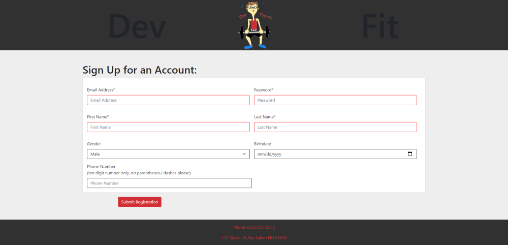
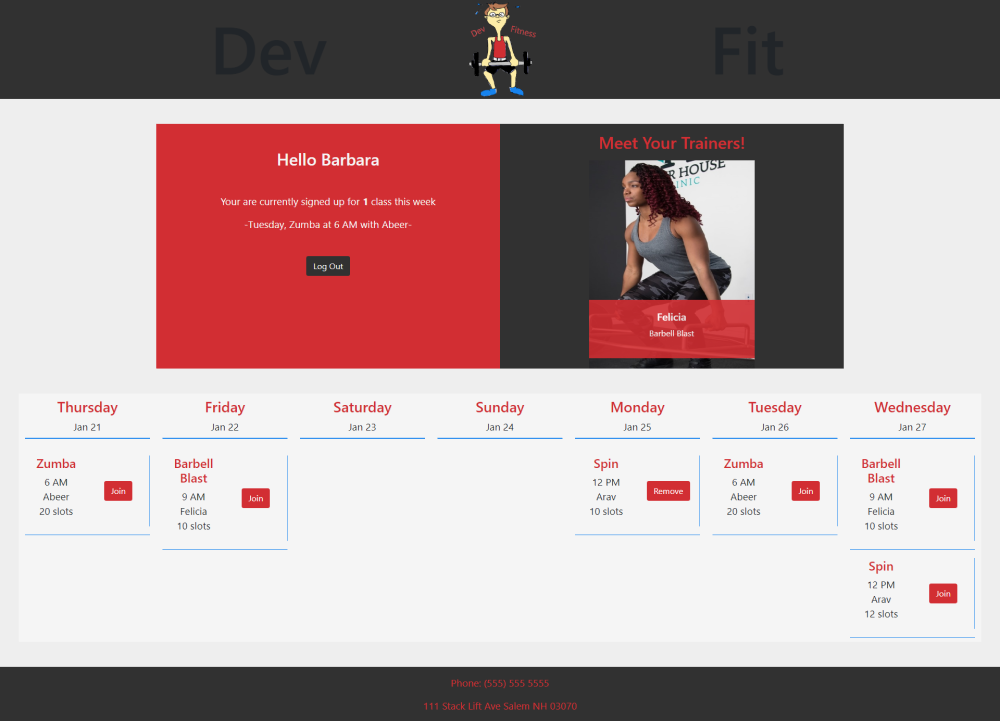
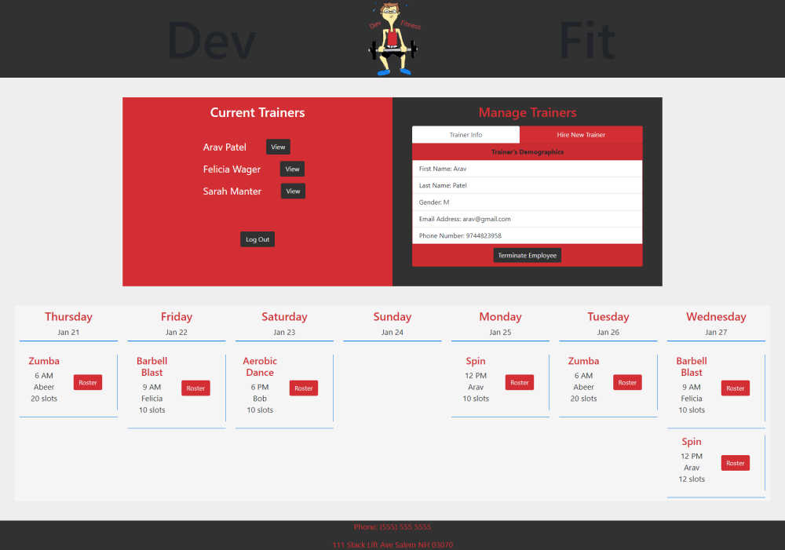
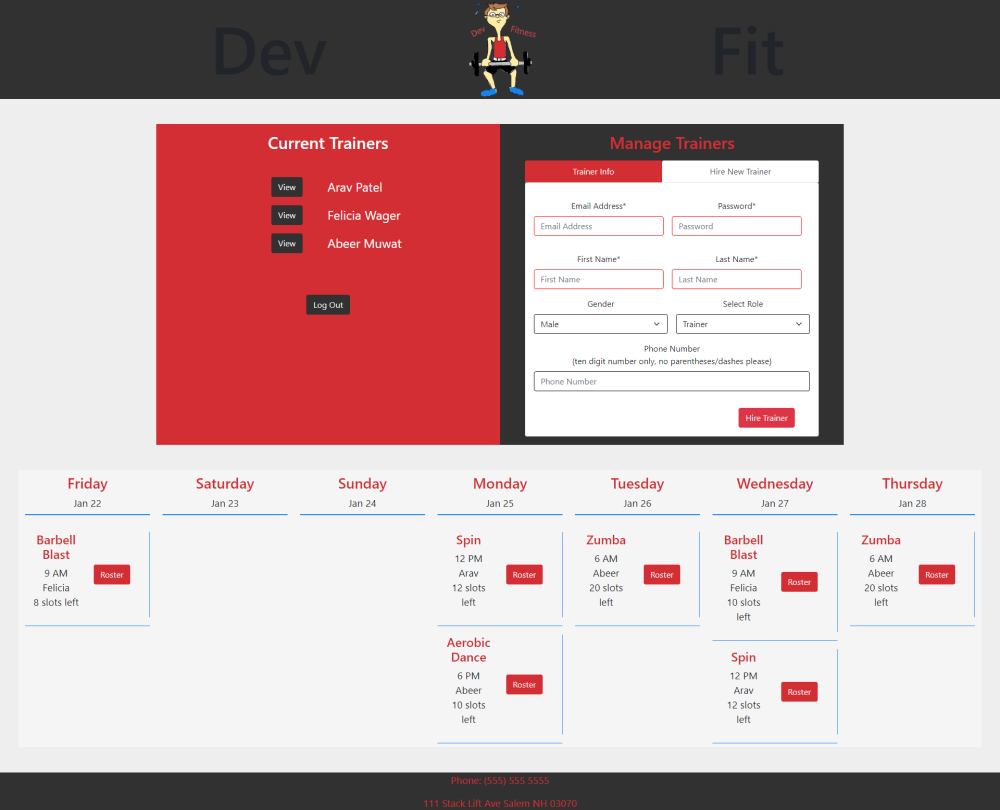
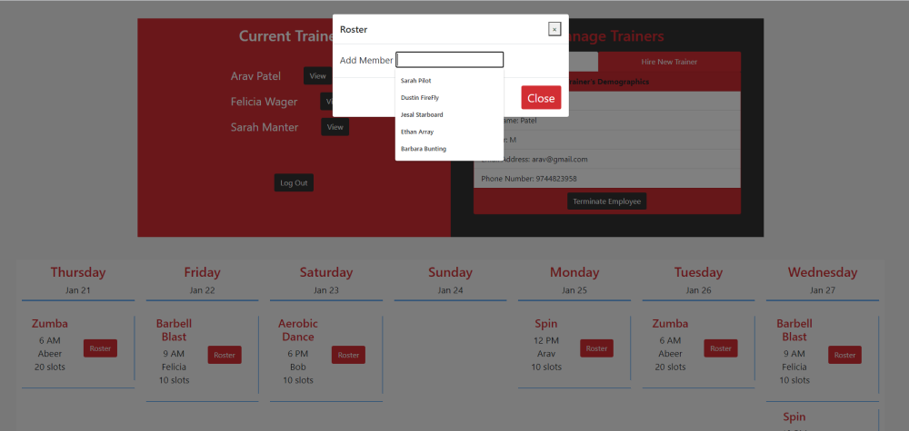

# Dev Fit Gym Logistical Tracker

## Description

This is a gym tracker app which allows clients to create accounts, log in with existing accounts, see trainer information, and view and join classes. It also allows trainers to add or remove their own classes. Managers on this app are able to view a list of trainers employed by the gym, pull up an individual trainer's information, terminate a trainer's employment by removing that trainer from the database, or hire a new trainer by adding his/her information into the database. A manager can also view all classes available at the gym for the week, view class rosters, and add/remove members from class rosters.

## Why build this app? 

I've worked in the fitness industry for over a decade, and all of the gym apps i've used have been terrible. It is always clear that the logic behind them wasn't well translated to be friendly for day to day business. Oftentimes, apps i've used have many frills but are lacking glaringly basic services like sorting employees. This project is the first step in building an app that takes better consideration of the needs of managers and members. I will expand on it in the future by doing a refactor in react. 

## Deployed Application Link

[Dev_Fit_Application](https://gym-logistical-tracker-duex.herokuapp.com/)

Dummy Login Info: Use these to log in and access the different. 
None of these are real life user/passwords

Member Username: Dwreck@over9000.com
Member Password: dustin1 

Trainer Username: F@yahoo.com
Trainer Password: felicia1

Manager Username: jimdhima@yahoo.com
Manager Password: 50%dhima

## Screenshots

## Table of Contents

- [Technologies](#Technologies)
- [Usage](#Usage)
- [Installation](#Installation)
- [Feedback](#Feedback)
- [Challenges](#Challenges)
- [Future Development](#Future_Development)
- [Walkthrough Video](#Walkthrough)
- [Copyrights/Acknowledgements](#Copyrights/Acknowledgements)

## Technologies

- node.js
- mysql
- sequelize
- body-parser
- dotenv
- express
- jest
- md5
- mysql2
- nodemon
- server

## Usage

1. Clients
   - Register for account from home page.
   - Log in with registered account from home page.
   - Join or drop classes.
   - View classes they've registered for.
   - View Gym's trainers.
2. Trainers
   - Log in from home page.
   - Add Classes/classtimes for the week to be taught by that trainer.
   - Delete Classes from the week that were added by that trainer.
3. Managers
   - Log in from home page.
   - View list of trainers.
   - View each trainer's demographics information.
   - Terminate a trainer / remove him/her from the database.
   - Hire a new trainer by entering his/her information into the database.
   - View all classes being offered by the gym for the week.
   - View class rosters.
   - Add members to roster or delete members from roster for each class (in case client needs help with this process for some reason).

## Installation

- Install [node.js](https://nodejs.org/en/download/)
- Open server.js in node.js integrated terminal, and install dependencies with `npm install`

## Feedback

Contact us with any feedback or questions through GitHub or by email.

- [Dustin](https://github.com/DustinErwin) (Dustin's commits are registered as NewWorldCoder603.)
- [Ethan](https://github.com/Ewager1)
- [Jesal](https://github.com/JesalDM)
- [Sarah](https://github.com/smanter82/)

## Challenges

- Keeping project scope small enough to meet the deadline
- Organizing a large amount of API's.
- Figuring out how MySQL joins would work with Sequelize
- Rotating calendar logic based on current date.

## Future_Development

- Expanding the rotating week to be a full calendar.
- Adding a router controller
- Adding user authorization
- Improved user error handling
- Membership pricing and records

## Walkthrough

[Walkthrough Video](https://drive.google.com/file/d/1waBdCG9vFMojRRJAujn7LDis4MAf_Nr8/view)

## Copyrights/Acknowledgements 

(For md5 npm package)

Copyright © 2011-2015, Paul Vorbach.
Copyright © 2009, Jeff Mott.

All rights reserved.

Redistribution and use in source and binary forms, with or without modification,
are permitted provided that the following conditions are met:

- Redistributions of source code must retain the above copyright notice, this
  list of conditions and the following disclaimer.
- Redistributions in binary form must reproduce the above copyright notice, this
  list of conditions and the following disclaimer in the documentation and/or
  other materials provided with the distribution.
- Neither the name Crypto-JS nor the names of its contributors may be used to
  endorse or promote products derived from this software without specific prior
  written permission.

THIS SOFTWARE IS PROVIDED BY THE COPYRIGHT HOLDERS AND CONTRIBUTORS "AS IS" AND
ANY EXPRESS OR IMPLIED WARRANTIES, INCLUDING, BUT NOT LIMITED TO, THE IMPLIED
WARRANTIES OF MERCHANTABILITY AND FITNESS FOR A PARTICULAR PURPOSE ARE
DISCLAIMED. IN NO EVENT SHALL THE COPYRIGHT HOLDER OR CONTRIBUTORS BE LIABLE FOR
ANY DIRECT, INDIRECT, INCIDENTAL, SPECIAL, EXEMPLARY, OR CONSEQUENTIAL DAMAGES
(INCLUDING, BUT NOT LIMITED TO, PROCUREMENT OF SUBSTITUTE GOODS OR SERVICES;
LOSS OF USE, DATA, OR PROFITS; OR BUSINESS INTERRUPTION) HOWEVER CAUSED AND ON
ANY THEORY OF LIABILITY, WHETHER IN CONTRACT, STRICT LIABILITY, OR TORT
(INCLUDING NEGLIGENCE OR OTHERWISE) ARISING IN ANY WAY OUT OF THE USE OF THIS
SOFTWARE, EVEN IF ADVISED OF THE POSSIBILITY OF SUCH DAMAGE.
